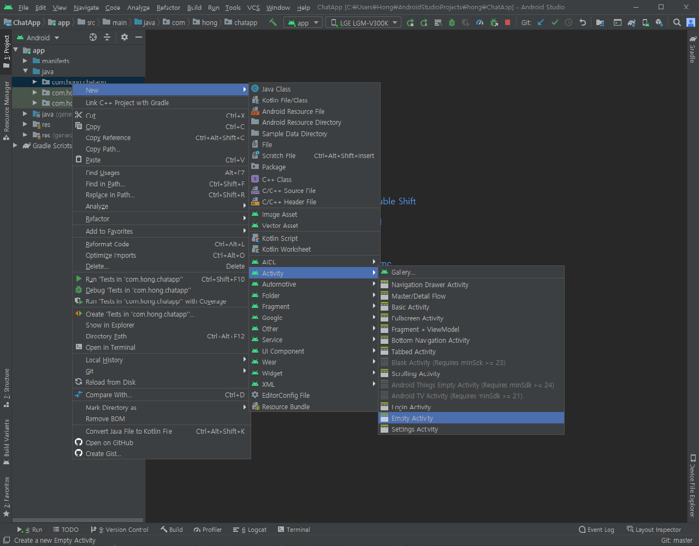
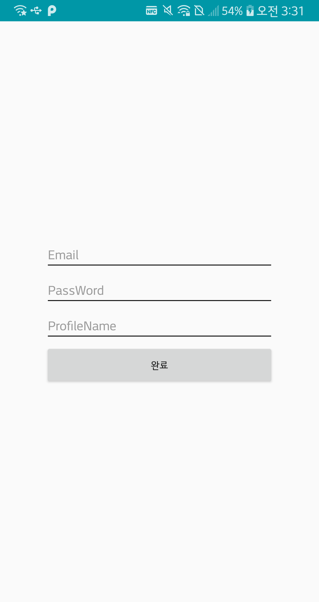
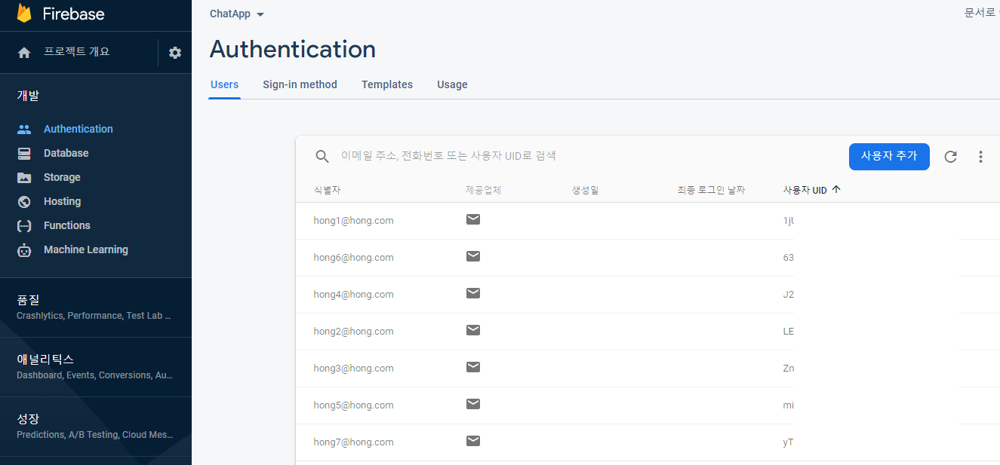
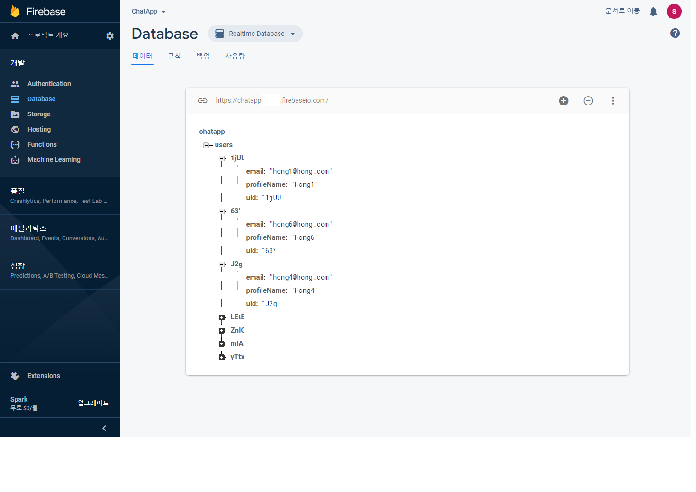

## 회원가입 화면(SignupActivity.java) 만들기



위의 그림과 같이 폴더에서 오른쪽 클릭을 하여 액티비티 이름을 SignupActivity로 만들어준다. 

`activity_signup.xml` 파일은 이메일과 패스워드, 그리고 프로필이름을 작성하는 `EditText`를 추가하고, 완료 버튼을 추가한다. 




`SignupActivity.java` 파일에 코드를 입력한다.

```java

public class SignupActivity extends AppCompatActivity {
    private static final String TAG = "Signup";

    private EditText signUpEmail;
    private EditText signUpPassword;
    private EditText profileName;
    private Button SignupDone;
    private FirebaseAuth mAuth;
    private DatabaseReference mDatabase;

    @Override
    protected void onCreate(Bundle savedInstanceState) {
        super.onCreate(savedInstanceState);
        setContentView(R.layout.activity_signup);

        signUpEmail = (EditText) findViewById(R.id.signUpEmail);
        signUpPassword = (EditText) findViewById(R.id.signUpPassword);
        profileName = (EditText) findViewById(R.id.profileName);

        SignupDone = (Button) findViewById(R.id.SignupDone);

        mAuth = FirebaseAuth.getInstance();
        mDatabase = FirebaseDatabase.getInstance().getReference("users");

        SignupDone.setOnClickListener(new View.OnClickListener(){
            @Override
            public void onClick(View view) {
                final String email = signUpEmail.getText().toString().trim();
                String password = signUpPassword.getText().toString().trim();
                final String name = profileName.getText().toString().trim();

                if(email.equals("") || password.equals("")) {
                    Toast.makeText(getApplicationContext(), "아이디와 비밀번호를 입력하세요.", Toast.LENGTH_SHORT).show();
                }
                else if(name.equals("")) {
                    Toast.makeText(getApplicationContext(), "닉네임을 입력하세요.", Toast.LENGTH_SHORT).show();
                }
                else {
                    // 회원가입
                }
            }
        });
    }
}

```

우선  `FirebaseAuth` 객체와 `FirebaseDatabase`객체의 `DatabaseReference` 인스턴스를 가져왔다.

```java
mAuth = FirebaseAuth.getInstance();
mDatabase = FirebaseDatabase.getInstance().getReference("users");
``` 

회원가입이 완료되었을때, FirebaseDatabase의 **users** 항목에 사용자의 정보를 추가하여 관리할 예정이다.

User 클래스를 정의할 `User.java` 파일을 생성해서 다음과 같이 추가하고, `email`, `profileName`, `Uid`에 대한 **Getter**와 **Setter**을 생성해준다.

```java
public class User {
    String email;
    String profileName;
    String Uid;

    public User(){}

    public User(String email, String profileName, String Uid) {
        this.email = email;
        this.profileName = profileName;
        this.Uid = Uid;
    }
// Generate Getter and Setter 
```


그다음에 회원가입 버튼에 `OnClick` 메소드를 구현하였다. 각 `editText`에 입력되어있는 글자를 받아오고, 빈칸이라면 토스트 상자를 출력하고, 빈칸이 아닐시에 회원가입이 완료되도록 하였다.

회원가입은 `createUserWithEmailAndPassword` 메소드를 사용하여 하면 된다. `OnClick` 메소드에서 `else`부분에 다음과 같이 코드를 작성해준다.

```java
...
                else {
                    mAuth.createUserWithEmailAndPassword(email, password)
                            .addOnCompleteListener(SignupActivity.this, new OnCompleteListener<AuthResult>() {
                                @Override
                                public void onComplete(@NonNull Task<AuthResult> task) {
                                    if (task.isSuccessful()) {
                                        Toast.makeText(getApplicationContext(), "회원가입 성공", Toast.LENGTH_SHORT).show();
                                        FirebaseUser user = mAuth.getCurrentUser();
                                        updateUI(user, name);
                                        User newuser = new User(email, name, user.getUid());
                                        mDatabase.child(user.getUid()).setValue(newuser);
                                    } else {
                                        Toast.makeText(getApplicationContext(), "회원가입 실패", Toast.LENGTH_SHORT).show();
                                    }
                                }
                            });
                }
...

``` 

입력받은 이메일과 패스워드를 이용하여 회원가입을 하고, `updateUI` 메소드를 이용하여 사용자의 프로필을 업데이트 한다.
그리고 **User** 객체를 생성하고, `setValue`메소드를 이용하여 데이터베이스에 저장한다. 

`updateUI` 메소드의 코드는 다음과 같이 설정하면 된다.
```java
public void updateUI(FirebaseUser user, String name) {
        UserProfileChangeRequest profileUpdates = new UserProfileChangeRequest.Builder()
                .setDisplayName(name)
                .build();
        user.updateProfile(profileUpdates)
                .addOnCompleteListener(new OnCompleteListener<Void>() {
                    @Override
                    public void onComplete(@NonNull Task<Void> task) {
                        if (task.isSuccessful()) {
                            Log.d(TAG, "User profile updated.");
                        }
                    }
                });
    }
```

앱을 실행하고 화원가입 버튼을 누르고 Firebase 홈페이지에 가서 확인을 한다.

아래 그림과 같이 사용자가 추가된 것을 확인할 수 있다.


<br>

그다음에 Database에도 추가된 것을 확인한다.

