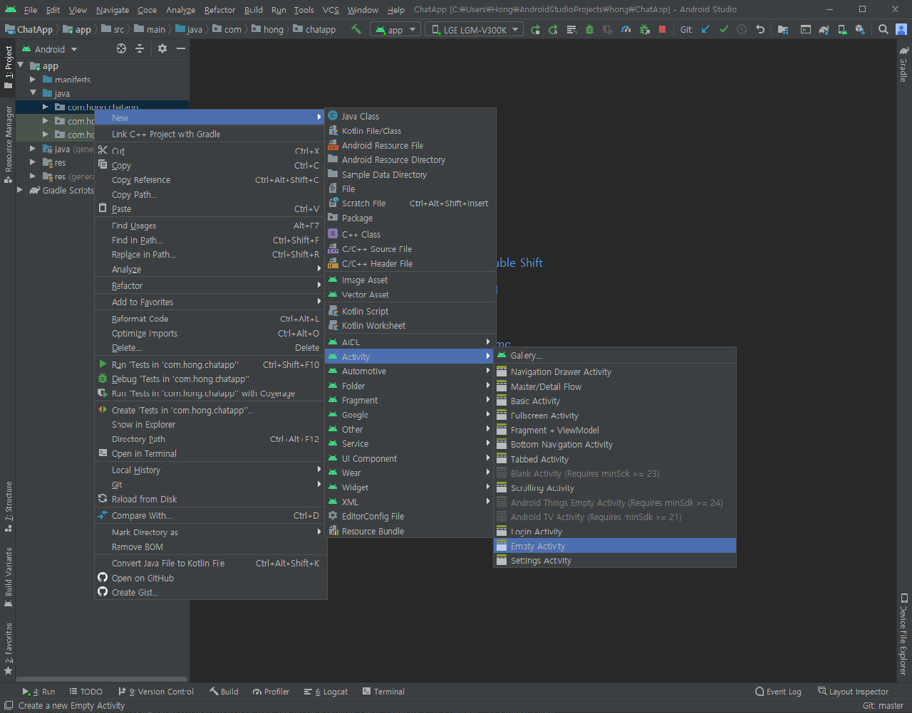

## 로그인 화면(LoginActivity.java) 만들기



위의 그림과 같이 폴더에서 오른쪽 클릭을 하여 액티비티 이름을 LoginActivity로 만들어준다. 

`activity_login.xml` 파일은 ID와 패스워드 입력칸과 로그인, 회원가입 버튼으로 구성한다.


 

그다음 `LoginActivity.java`에 코드를 입력해준다.
```java
public class LoginActivity extends AppCompatActivity {

    private Button buttonlogin;
    private Button buttonsignup;
    private EditText editTextemail;
    private EditText editTextpassword;
    FirebaseAuth firebaseAuth;

    @Override
    protected void onCreate(Bundle savedInstanceState) {
        super.onCreate(savedInstanceState);
        setContentView(R.layout.activity_login);

        firebaseAuth = firebaseAuth.getInstance();

        buttonlogin = (Button) findViewById(R.id.buttonLogin);
        buttonsignup = (Button) findViewById(R.id.buttonSignup);
        editTextemail = (EditText) findViewById(R.id.editTextEmail);
        editTextpassword = (EditText) findViewById(R.id.editTextPassword);

        buttonlogin.setOnClickListener(new View.OnClickListener() {
            @Override
            public void onClick(View view) {
                //로그인 버튼
            }
        });

        buttonsignup.setOnClickListener(new View.OnClickListener() {
            @Override
            public void onClick(View view) {
                //회원가입 버튼
                Intent intent = new Intent(LoginActivity.this, SignupActivity.class);
                startActivity(intent);
                
            }
        });
    }
}
```

로그인 버튼과 회원가입 버튼에 각각 `OnClick`메소드를 만들어주었다.
<br>회원가입 버튼을 눌렀을때는, `signupActivity` 화면을 띄우도록 해준다.


그다음에 로그인은 `firebaseAuth.signInWithEmailAndPassword` 메소드를 이용하여 한다.
사용자가 입력한 `email`과 `password`를 인자로 전달하여 로그인 성공시에 MainActivity를 띄우도록 한다.

아직 MainActivity를 구성하지 않았으므로, 토스트 메세지만 띄운다.


```java
...

buttonlogin.setOnClickListener(new View.OnClickListener() {
            @Override
            public void onClick(View view) {
                String email = editTextemail.getText().toString().trim();
                String password = editTextpassword.getText().toString().trim();

                firebaseAuth.signInWithEmailAndPassword(email, password)
                        .addOnCompleteListener(LoginActivity.this, new OnCompleteListener<AuthResult>(){
                            @Override
                            public void onComplete(@NonNull Task<AuthResult> task) {
                                if (task.isSuccessful()) {
                                    Toast.makeText(getApplicationContext(), "로그인 성공", Toast.LENGTH_SHORT).show();
                                    //메인 액티비티 띄우기
                                } else {
                                    Toast.makeText(getApplicationContext(), "로그인 실패", Toast.LENGTH_SHORT).show();
                                }
                            }
                        });
            }
        });

...
```