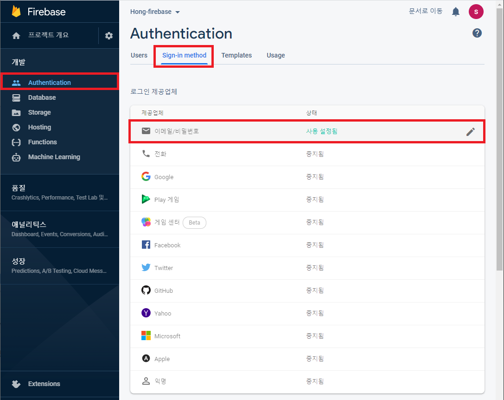

### 파이어베이스 이용하여 로그인 관리

> [파이어베이스 공식문서](https://firebase.google.com/docs/auth/android/password-auth)

#### 로그인, 회원가입 화면 만들기, 회원가입 기능 구현하기

우선 [파이어베이스 홈페이지](https://firebase.google.com/?hl=ko)에 접속한다.

Authentication -> Sign-in method 에서 로그인 제공업체를 설정해줄수 있는데, 현재는 이메일 로그인만 사용으로 해준다.




그다음에 두가지 액티비티를 만들어준다. 하나는 로그인 화면을 나타내는 **LoginActivity**, 또 하나는 회원가입 화면을 나타내는 **SignupActivity** 를 만들어준다.

화면을 다음과 같이 구성해준다.


다음 **LoginActivity.java** 파일과 **SignupActivity.java**파일을 수정해준다.

LoginActivity.java
```java


public class LoginActivity extends AppCompatActivity {

    private Button buttonlogin;
    private Button buttonsignup;
    private EditText editTextemail;
    private EditText editTextpassword;
    FirebaseAuth firebaseAuth;

    @Override
    protected void onCreate(Bundle savedInstanceState) {
        super.onCreate(savedInstanceState);
        setContentView(R.layout.activity_login);

        buttonlogin = (Button) findViewById(R.id.buttonLogin);
        buttonsignup = (Button) findViewById(R.id.buttonSignup);
        editTextemail = (EditText) findViewById(R.id.editTextEmail);
        editTextpassword = (EditText) findViewById(R.id.editTextPassword);

        //firebaseAuth = firebaseAuth.getInstance();

        buttonlogin.setOnClickListener(new View.OnClickListener() {
            @Override
            public void onClick(View view) {
                //로그인 버튼 구현
            }
        });

        buttonsignup.setOnClickListener(new View.OnClickListener() {
            @Override
            public void onClick(View view) {
                //회원가입 버튼
                Intent intent = new Intent(LoginActivity.this, SignupActivity.class);
                startActivity(intent);
            }
        });
    }
}

```
<br>

SignupActivity.java
```java

public class SignupActivity extends AppCompatActivity {
    private static final String TAG = "Signup";

    private EditText signUpEmail;
    private EditText signUpPassword;
    private Button SignupDone;
    FirebaseAuth mAuth;

    @Override
    protected void onCreate(Bundle savedInstanceState) {
        super.onCreate(savedInstanceState);
        setContentView(R.layout.activity_signup);

        signUpEmail = (EditText) findViewById(R.id.signUpEmail);
        signUpPassword = (EditText) findViewById(R.id.signUpPassword);

        SignupDone = (Button) findViewById(R.id.SignupDone);

        mAuth = FirebaseAuth.getInstance();

        SignupDone.setOnClickListener(new View.OnClickListener(){
            @Override
            public void onClick(View view) {
                String email = signUpEmail.getText().toString().trim();
                String password = signUpPassword.getText().toString().trim();

                mAuth.createUserWithEmailAndPassword(email, password)
                        .addOnCompleteListener(SignupActivity.this, new OnCompleteListener<AuthResult>() {
                            @Override
                            public void onComplete(@NonNull Task<AuthResult> task) {
                                if (task.isSuccessful()) {
                                    Toast.makeText(getApplicationContext(), "로그인 성공", Toast.LENGTH_SHORT).show();
                                    finish();
                                } else {
                                    Toast.makeText(getApplicationContext(), "로그인 실패", Toast.LENGTH_SHORT).show();
                                }
                            }
                        });
            }
        });

    }
}

```

다음 Firebase 홈페이지에서 Authentication -> Users 화면에 들어가면 사용자 목록에 추가된 것을 확인할 수 있다.


그다음 로그인을 확인하면 띄울 MainActivity를 만들어주고, 로그아웃 버튼을 만들어준다.
<br>

MainActivity.java
```java
public class MainActivity extends AppCompatActivity {
    final static String TAG = "MainActivity";

    @Override
    protected void onCreate(Bundle savedInstanceState) {
        super.onCreate(savedInstanceState);
        setContentView(R.layout.activity_main);

        Button buttonlogout = (Button) findViewById(R.id.buttonLogout);

        buttonlogout.setOnClickListener(new View.OnClickListener(){
            @Override
            public void onClick(View view) {
                FirebaseAuth.getInstance().signOut();
                finish();
            }
        });
    }
}
```

로그인 화면에서 아이디와 비밀번호를 입력하고 로그인 버튼을 눌렀을때 화면이 넘어가도록 만들어준다.

LoginActivity.java
```java
...

    firebaseAuth.signInWithEmailAndPassword(email, password)
                            .addOnCompleteListener(LoginActivity.this, new OnCompleteListener<AuthResult>(){
                                @Override
                                public void onComplete(@NonNull Task<AuthResult> task) {
                                    if (task.isSuccessful()) {
                                        Toast.makeText(getApplicationContext(), "로그인 성공", Toast.LENGTH_SHORT).show();
                                        Intent intent = new Intent(LoginActivity.this, MainActivity.class);
                                        startActivity(intent);
                                    } else {
                                        Toast.makeText(getApplicationContext(), "로그인 실패", Toast.LENGTH_SHORT).show();
                                    }
                                }
                            });

...
```